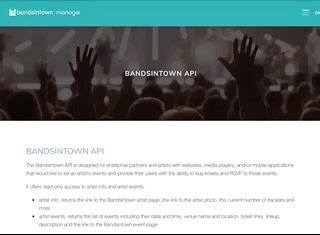
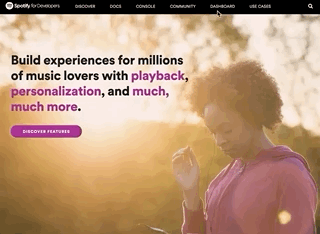
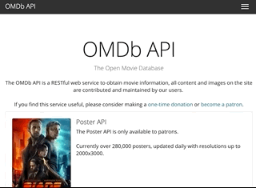
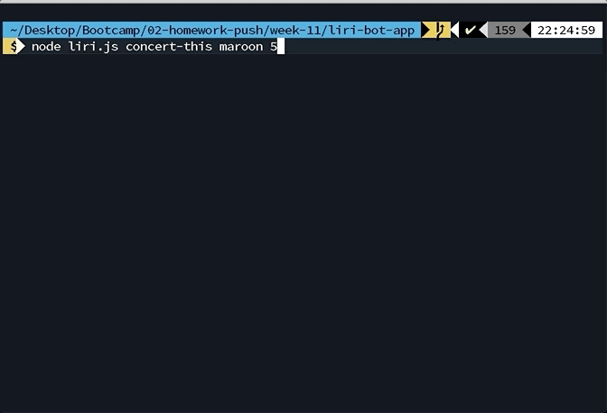
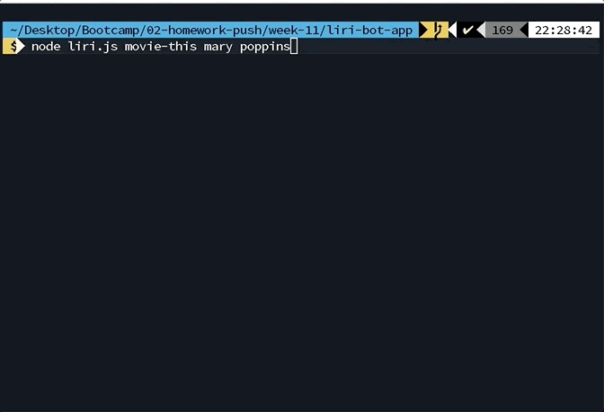
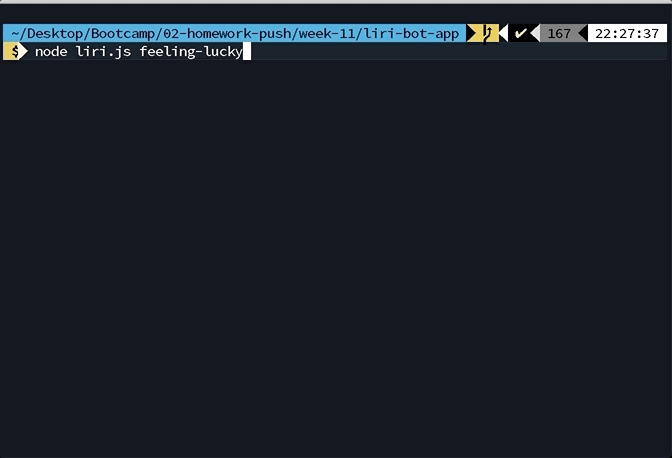

# LIRI

A Node.js app to search for band, song, or movie.

## Description

A Node.js app with one of three requested commands searches for different queries, an option to send a argument from a text file, and an option that choses a random choice from a text file to search for the user.

## Getting Started

### Dependencies

- Sign up for a BandInTown app ID [here.](https://manager.bandsintown.com/support/bandsintown-api) This should be as soon as possible since the service requires a written email request to the support staff that will be responded with a key to the email address used.  
  
- A Spotify ID key and Spotify secret key will be needed as well as a Spotify user account. You can get them [here.](https://developer.spotify.com "Spotify for Developers")  
  
- Sign up for OMDB apikey [here.](http://www.omdbapi.com/)  
  

### Installing

- Terminal inputs
  - `npm init` --> for your package.json file
  - `npm install dotenv`
  - `npm install moment`
  - `npm install spotify`
  - `npm install omdb`
  - `npm install request`

### Executing program

- `node liri.js concert-this <artist/band name>` --> returns artist/band future band date from BandInTown.



- `node liri.js spotify-this-song <song title>` --> returns song from Spotify database.


- `node liri.js movie-this <movie title>` --> returns a movie from OMDB.



- `node liri.js do-what-it-says` --> returns the song "I Want it That Way" by passing in the song title in through the arguments.


- `node liri.js feeling-lucky` --> returns one of the three options choices with 20 options, so a total of 60 random choices.



## Help

All commands that can be entered.

```
node liri.js help
```

## Authors

Contributors names and contact info

Developer: Carl Vega  
Email: git.vega@gmail.com  
Twitter: [@Carljasonvega](https://twitter.com/Carljasonvega)

## Version History

- 0.1
  - Initial Release

## License

Open sourced via ISC license.

## Acknowledgments

Coding Boot Camp UNC

## Media
